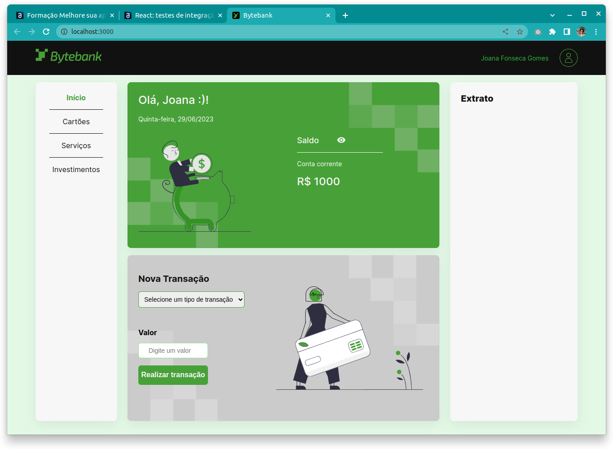

<div style="text-align: center; font-size: 32px;margin-bottom: 20px"> 
    React com Testes Automatizados
</div>

<div style="text-align: center">


</div>



> Projeto para estudos de testes utilizando jest e testing library

## 💻 Pré-requisitos

Antes de começar, verifique se você atendeu aos seguintes requisitos:
* Você instalou a versão mais recente do `node`
* Você tem uma máquina `Windows, Linux ou Mac `. 

## 🚀 Instalando alura-testes

Para instalar o alura-testes, siga estas etapas:

```
npm instal
```

ou 

```
yarn install
```

## ☕ Usando alura-testes

Para usar alura-testes, siga estas etapas:

```
npm run start
```

ou 

```
yarn start
```


[⬆ Voltar ao topo](#nome-do-projeto)<br>